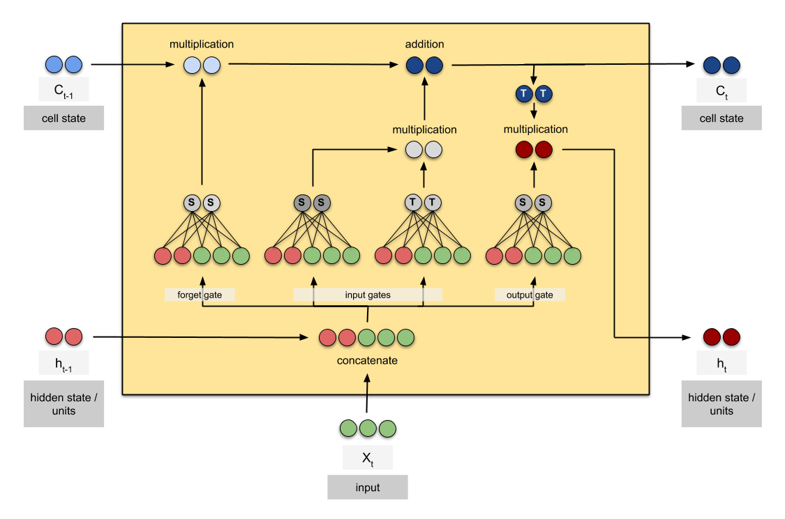
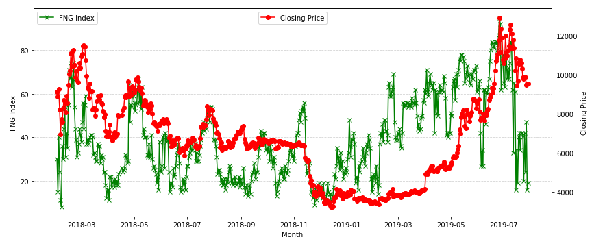
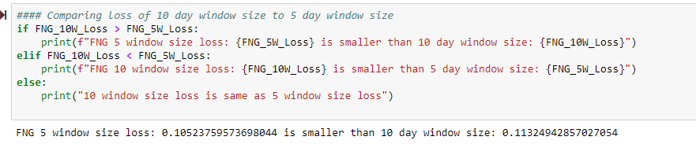
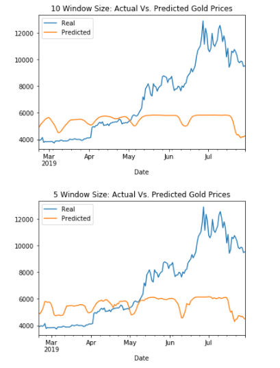
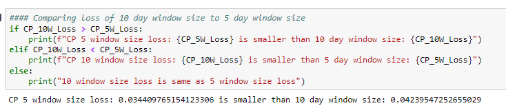
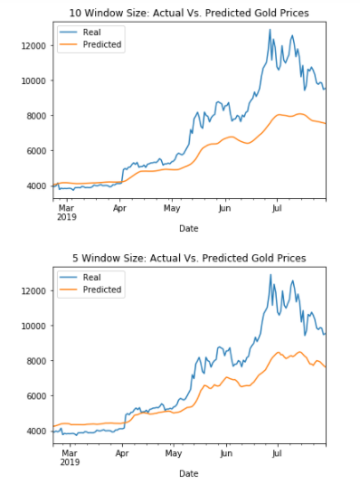

###                               Stock Price predicton using Deep Learning 


---

Forecasting stock prices requires us to look for patterns or hints from history of data, removing any noise and then 
predicting the future.
Time series data is a form of sequential data and we shall be using univariate stock time series data.
We shall be comparing two models  -
- Predict closing price based on [FNG](https://alternative.me/crypto/fear-and-greed-index/) index
- Predict closing price using previous closing prices

**LTSM Model** which is a typle of Deep Learning supervised model which does not learn its parameters from features
but from the outputs of preceeding leayers. LTSM also resolves the problem of exploding and vanishing gradient.

A good description of LTSM is described [here](https://tung2389.github.io/coding-note/unitslstm)


LTSM hence is a good model to run against Stock price time series data.
---

**Data and Model Preperation**

We shall be initiating a seed to ensure reproducibility. We shall also be using two window sizes, 10 and 5, using past 10/5 
days of data of wither FNG index or closing price to predict the next closing price. Since the clsoing price or index can 
have a wide range, we shall be using MinMaxScalrer to scale the data within 0 and 1 range.
We shall also be splitting the data into train, test in the ratio of 70:30. We shall also be needed to convert the data set
in 3D array as LTSM expects a 3D array and for that we shall be using numpy reshape. Finally, we would be assuming certain
hyperparameters such as num_units and batch_size based on the number of input features and size of the data set.

*FNG index impact*

Let us check the trend of FNG index and closing prices,


As we can see, both move in the same manner and hence FNG might be able to provide a good prediction. 
We shall be running the models to optimize for Loss function. Lower loss is better.

---

Now let us compare a 10 day window vs 5 day window for FNG impact to closing price.

>
>
> - *Loss Comparison*

> 
>
> *5 day window size gives us a smaller Loss.*
>
>
> - *Prediction visualization*
>
> 
>
> *Again we do see 5 day window is more granular then 10 day window prediction.*
>

As we can see from above, FNG does move in the same direction but the magnitude is not same.


Now let us compare a 10 day window vs 5 day window for previous closing price impact to closing price.

>
> - *Loss Comparison*
>
> 
>
> *5 day window size gives us a smaller Loss.*
>
> - *Prediction visualization*
>
> 
>
> *Again we do see 5 day window is more granular then 10 day window prediction.*

---


**Conclusions**

- *Determine which model had the lowest loss.*

Closing price model provides a  lower loss for either window size over FNG model.

- *Determine which model tracks the actual values best over time.*

Closing price model provides a better prediction  for either window size over FNG model.

- *Determine the appropriate Window Size for the model.*

5 Window size provides a better prediction and lower loss for both models.


```python

```
